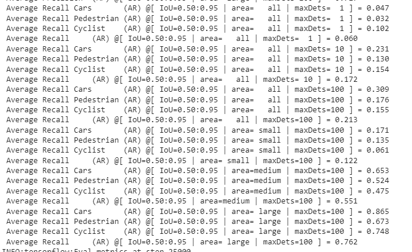

# 2D Object detection

Waymo Data set was used for the 2D Object detection.
Tensorflow Object detection (TFOD) was used to train and evaluate.
ssd_resnet50_v1_fpn_640x640_coco17 pretrained model weights were used to train.

To run the code and bring up the TFOD environment you can run the cells on [this installation notebook.](https://github.com/pavanp5/2d_object_detection/blob/main/Installation.ipynb)

The EDA, training and evaluation was done on google colab pro.
The notebooks have been provided on the git repo [2d Object detection](https://github.com/pavanp5/2d_object_detection).

The metadata such as timeofday, location and weather was extracted from the waymo data ,while converting to tfrecord format suitable for TFOD object detection model.
This metadata has been used to perform the train & eval split. The CSV files with metadata have been provided here [train_eval_split](https://github.com/pavanp5/2d_object_detection/tree/main/data)

The train set included data that was very representative. This can be evidenced in the [EDA notebook](https://github.com/pavanp5/2d_object_detection/blob/main/EDA_Train_Eval_Split.ipynb).

4 experiments were performed in total. 3 of the experiments yielded improvement in precision and accuracy. The exp1 model without augmentation overfits. The overfitting was reduced using augmentation and other improvements in experiment 4. The overfitting can however be reduced further if more training sequences are available. 202 training sequences were used for the experiments here each having around 200 images. The evaluation metrics and model visualization of detections are available here [Eval metrics notebook](https://github.com/pavanp5/2d_object_detection/blob/main/Evaluation_&_Model_Result_Visualization.ipynb).

|Model#  | Eval mAP@50 |Eval AR@100  | Eval total loss |Technique|
|--|--|--|--|--|
|  Exp1|28.82%  | 21.98% | 0.7441 |No Augmentation|
|Exp3| 28.9% | 21.3%  |  0.7386|Augmentation random crop, random contrast adjust
|Exp4|29.03|21.33%|0.7091|Sklearn Kmeans on gt boxes to get anchor aspect ratios, Scales per octave increased to 3, Augmentation-random crop,random contrast adjust

**Experiment 4 Category wise metric:**
|Category|  AP@50|AR@100|
|--|--|--|
| Cars | 42.4% |30.9%|
| Pedestrian | 27.2% |17.6%|
| Cyclist | 17.5% |15.5%|

**Model visualization:**
Exp4 detection images and videos:

**Videos of detections:**
[Day time detection video, ](https://github.com/pavanp5/2d_object_detection/blob/main/videos/animation_eval_otherloc_day.mp4)
[Phoenix rain video, ](https://github.com/pavanp5/2d_object_detection/blob/main/videos/animation_eval_phx_rain.mp4)
[SFO Dawn/Dusk detection video, ](https://github.com/pavanp5/2d_object_detection/blob/main/videos/animation_eval_sfo_dawndusk.mp4)
[SFO Day time detection video, ](https://github.com/pavanp5/2d_object_detection/blob/main/videos/animation_eval_sfo_day.mp4)
[SFO Night time detection video](https://github.com/pavanp5/2d_object_detection/blob/main/videos/animation_eval_sfo_night.mp4)

**What Augmentations were used and why?**
The exp1 model with no augmentation overfits. The number of images are considerably high but they are from same sequences. 202 sequences were used for training each having 200 images approximately.  So, random crop was used so that the images of the sequence are cropped and at different regions thus reducing overfit. The second augmentation used was random adjust contrast. The data has night sequences and dawn/dusk sequences, so adjusting contrast would help train for the dawn/ dusk scenarios too. The augmentations can be viewed here [Augmentations notebook](https://github.com/pavanp5/2d_object_detection/blob/main/Augmentations.ipynb).

**What changes were made to improve model over after augmentation was applied?**
Exp4 config metric improved, the eval loss reduced compared to previous experiments. 
2 Changes below were made
 1. Anchor box aspect ratios were calculated from train dataset ground truth boxes. 
 2. Scales per octave was increased to 3

Kmeans Clustering was used on the ground truth bounding boxes to derive suitable anchor box aspect ratios. The code and plots for the same can be observed at the end of this notebook [anchor box calculation at the end of this notebook](https://github.com/pavanp5/2d_object_detection/blob/main/Augmentations.ipynb).

**Other details:**
Cosine decay scheduler has been used. The classification, localization loss and learning rate decay plots can be viewed on tensor board plots.

**Training Experiment4** 

**Training Experiment3**

**Training Experiment1**

**Evaluation metric Experiment4**

**Evaluation metric Experiment3**

**Evaluation metric Experiment1**

**Category wise metric for experiment 4 (Cars, Pedestrian and Cyclist):**
**Precision Category level Exp4**

**Recall category level Exp 4**

Sigmoid Focal loss was used for classification loss to have the hard examples learnt given the imbalance between classes. Gamma value was increased greater than 2 but was suitable. Gamma equal zero is equivalent to categorical cross entropy and was not suitable.

Based on the study or referring of few related research papers the following will be taken up as next steps, i.e. building the model from scratch thereby having control to extract features from layers and fuse them. Currently SSD is not very good with small objects. This is because the lower layers which are used for small objects detection do not have enough information to detect object. If information from other layers higher up can be fused with this the prediction small objects can be improved. 